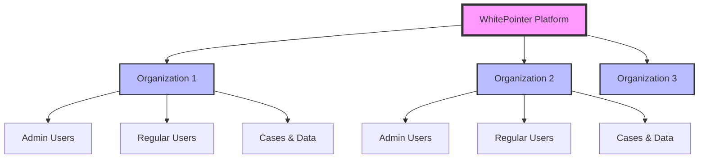
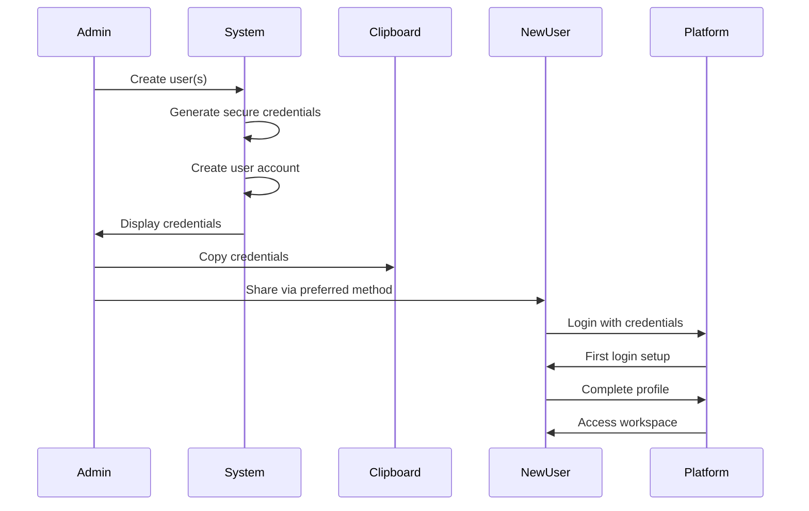
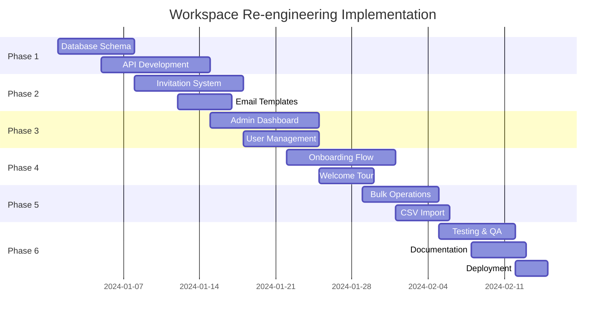

# Workspace Functionality Analysis & Re-Engineering Plan

## Executive Summary

This document provides a comprehensive analysis of the current workspace functionality in the WhitePointer motorcycle rental management system and presents a detailed re-engineering plan to transform it into a best-in-class user management platform with a simplified, manual credential distribution system that bypasses email complications.

**KEY CHANGE**: This plan focuses on a manual credential management system where the admin interface generates secure usernames and passwords that can be copied and manually shared, eliminating dependency on unreliable email services like Brevo.

---

## Quick Start Guide: How to Onboard Clients and Create Workspaces

### 🚀 Step-by-Step Onboarding Process

#### Step 1: Create a New Workspace
1. **Navigate to Admin Dashboard** → Click "Workspaces" → "Create New Workspace"
2. **Fill in Workspace Details:**
   - Workspace Name: "ABC Law Firm" or "John's Rentals"
   - Type: Select "Law Firm" or "Rental Company"
   - Contact Details: Add primary contact info
3. **Click "Create Workspace"** - System generates unique workspace ID

#### Step 2: Add Users to the Workspace
1. **In the Workspace view**, click "Add User" button
2. **Enter User Details:**
   - Email: user@example.com
   - Name: John Smith
   - Role: Select "Workspace User"
3. **Click "Create User"** - System automatically:
   - Generates secure password
   - Creates user account
   - Links user to workspace
   - Displays credentials immediately

#### Step 3: Copy and Share Credentials
1. **Credential Modal Appears** with:
   ```
   ✅ User Created Successfully
   
   Username: user@example.com
   Password: Xk9#mP2$vL
   Workspace: ABC Law Firm
   Login URL: https://app.whitepointer.com/login
   
   [Copy All] [Copy Username] [Copy Password] [Print]
   ```
2. **Click "Copy All"** to copy formatted credentials
3. **Share via your preferred method:**
   - Text message / WhatsApp
   - Phone call
   - In-person meeting
   - Written note

#### Step 4: Track Distribution
1. **After sharing**, click "Mark as Distributed"
2. **Add optional note**: "Sent via WhatsApp on 13/08/2025"
3. **System tracks:**
   - Distribution timestamp
   - Distribution method/notes
   - First login status

### 📋 Bulk Onboarding (Multiple Users)

#### Option A: Quick Bulk Add
1. **Click "Bulk Add Users"** in workspace view
2. **Enter multiple emails** (one per line):
   ```
   john@lawfirm.com
   sarah@lawfirm.com
   admin@lawfirm.com
   ```
3. **Click "Generate All Credentials"**
4. **System displays all credentials** in a table
5. **Export options:**
   - Download as PDF
   - Export to CSV
   - Copy all to clipboard

#### Option B: CSV Import
1. **Prepare CSV file** with columns:
   ```csv
   email,name,role
   john@example.com,John Smith,workspace_user
   sarah@example.com,Sarah Jones,workspace_user
   ```
2. **Click "Import CSV"**
3. **Select your file** → Review and confirm
4. **Download credentials** as PDF or CSV

### 💼 Common Onboarding Scenarios

#### Law Firm Onboarding
```
1. Create workspace "Smith & Associates Law"
2. Add 3 users (lawyer, paralegal, admin)
3. Generate credentials for all
4. Send credentials via secure message
5. Users login and access their cases
```

#### Rental Company Onboarding
```
1. Create workspace "City Bike Rentals"
2. Add manager account
3. Generate and share credentials
4. Manager logs in to manage fleet
5. Add additional staff as needed
```

#### Insurance Company Access
```
1. Create workspace "ABC Insurance"
2. Add claims adjuster accounts
3. Bulk generate 10 user credentials
4. Export to PDF
5. Share PDF with insurance coordinator
```

### 🎯 What Happens After User Gets Credentials

1. **User receives credentials** via your chosen method
2. **User navigates** to login page
3. **User enters** username and password
4. **First login detected** - system prompts:
   - Optional password change
   - Profile completion
   - Workspace tour
5. **User accesses** their workspace with full functionality

### ⚡ Admin Quick Actions Interface

```
┌─────────────────────────────────────┐
│  Workspace: ABC Law Firm            │
│  Users: 5 | Active: 3               │
├─────────────────────────────────────┤
│  [+ Add User]  [Bulk Add]  [Import] │
│  [View Credentials]  [Export All]   │
│  [Workspace Settings]  [Activity]   │
└─────────────────────────────────────┘
```

### 📊 Credential Management Dashboard

View all users and their credential status:

```
┌────────────────────────────────────────────────────────┐
│ Email              Status      Distributed  First Login │
├────────────────────────────────────────────────────────┤
│ john@example.com   ✅ Active   13/08/2025   14/08/2025 │
│ sarah@example.com  ⏳ Pending  13/08/2025   Not yet    │
│ admin@example.com  ✅ Active   13/08/2025   13/08/2025 │
└────────────────────────────────────────────────────────┤
```

### 🔑 Key Benefits of This Approach

- **100% Delivery Rate** - No email failures
- **Immediate Access** - Credentials available instantly
- **Full Control** - You decide when/how to share
- **No Email Costs** - Save on email service fees
- **Better Security** - No plain text passwords in email

---

## 📚 Complete Guide: How the Workspace System Works

### Understanding Workspaces in WhitePointer

**What is a Workspace?**
- A workspace is a **client organization** (law firm, rental company, insurance company)
- Each workspace has its own **isolated data** (cases, bikes, interactions)
- Users belong to workspaces and can only see their workspace's data
- Think of it as a **secure tenant** in your system

### 🎯 How to Assign Cases to Workspaces

#### Method 1: Assign During Case Creation
```
1. Create New Case → Fill case details
2. Select "Workspace" dropdown
3. Choose target workspace (e.g., "ABC Law Firm")
4. Save case → Case now belongs to that workspace
5. Only users in ABC Law Firm can see this case
```

#### Method 2: Reassign Existing Case
```
1. Open Cases list → Find the case
2. Click Edit → Change "Workspace" field
3. Select new workspace from dropdown
4. Save → Case moves to new workspace
5. Previous workspace loses access immediately
```

#### Method 3: Bulk Case Assignment
```
1. Go to Cases → Select multiple cases (checkbox)
2. Click "Bulk Actions" → "Assign to Workspace"
3. Choose target workspace
4. Confirm → All selected cases move
```

### 📊 How Workspace Access Control Works

```
┌─────────────────────────────────────────────────┐
│                 ADMIN VIEW                       │
│  Can see ALL cases across ALL workspaces        │
│  ┌─────────┐ ┌─────────┐ ┌─────────┐          │
│  │Workspace│ │Workspace│ │Workspace│          │
│  │    A    │ │    B    │ │    C    │          │
│  └─────────┘ └─────────┘ └─────────┘          │
└─────────────────────────────────────────────────┘

┌─────────────────────────────────────────────────┐
│            WORKSPACE USER VIEW                   │
│  Can ONLY see cases in their workspace          │
│                ┌─────────┐                      │
│                │Workspace│                      │
│                │    B    │                      │
│                └─────────┘                      │
│         (Cannot see A or C)                     │
└─────────────────────────────────────────────────┘
```

### 🔄 Complete Workflow: From Client to Case Management

#### Step 1: Client Signs Up (Law Firm Example)
```
1. Law firm contacts you: "We need rental bikes for our clients"
2. You create workspace: "Smith & Associates Law"
3. You create user account for the law firm
4. You share credentials with them
```

#### Step 2: Assign Cases to the Law Firm
```
1. New accident victim needs bike rental
2. Create case with victim details
3. Assign case to "Smith & Associates Law" workspace
4. Law firm can now manage this case
```

#### Step 3: Law Firm Manages Their Cases
```
Law firm logs in and sees:
- Only their assigned cases
- Their rental bikes
- Their client interactions
- Their documents
(They CANNOT see other law firms' data)
```

### 🚦 Case Assignment Rules

| User Role | Can Assign Cases | Can View Cases |
|-----------|-----------------|----------------|
| Admin | ✅ To any workspace | ✅ All workspaces |
| Developer | ✅ To any workspace | ✅ All workspaces |
| Workspace User | ❌ Cannot reassign | ✅ Only their workspace |
| Lawyer | ❌ Cannot reassign | ✅ Only their workspace |
| Rental Company | ❌ Cannot reassign | ✅ Only their workspace |

### 📋 Practical Examples

#### Example 1: New Law Firm Client
```
Day 1: Law Firm Onboarding
├── Create workspace "Johnson Legal"
├── Add 3 user accounts
├── Share credentials via WhatsApp
└── Users login and see empty workspace

Day 2: First Case Assignment
├── Accident victim John Doe needs bike
├── Create case #2024-001 for John Doe
├── Assign to "Johnson Legal" workspace
└── Law firm now sees and manages this case

Day 3: Multiple Cases
├── Add 5 more accident cases
├── Bulk assign all to "Johnson Legal"
├── Law firm dashboard shows 6 active cases
└── They manage rentals for all 6 clients
```

#### Example 2: Case Transfer Between Workspaces
```
Scenario: Case transfers from one law firm to another

1. Case #2024-001 currently with "ABC Law"
2. Client switches to "XYZ Law"
3. Admin reassigns case to "XYZ Law" workspace
4. "ABC Law" loses access immediately
5. "XYZ Law" gains access immediately
6. All case history preserved
```

#### Example 3: Insurance Company Access
```
Setup: Insurance company needs case visibility

1. Create workspace "State Insurance Co"
2. Create adjuster accounts
3. Assign relevant cases to their workspace
4. Adjusters can:
   - View case details
   - See rental agreements
   - Access documentation
   - Track claim progress
```

### 🎨 Visual Case Assignment Interface

```
Case Edit Screen:
┌──────────────────────────────────────┐
│ Case #2024-001                       │
├──────────────────────────────────────┤
│ Client: John Doe                     │
│ Status: Active                       │
│                                      │
│ Workspace Assignment:                │
│ ┌──────────────────────────────┐    │
│ │ ▼ Select Workspace           │    │
│ │   • Main (Unassigned)        │    │
│ │   • ABC Law Firm ✓           │    │
│ │   • XYZ Legal Services       │    │
│ │   • City Rentals             │    │
│ └──────────────────────────────┘    │
│                                      │
│ [Save Changes] [Cancel]              │
└──────────────────────────────────────┘
```

### 🔐 Security & Isolation

**What Workspace Users CAN Do:**
- ✅ View cases assigned to their workspace
- ✅ Manage bikes in their workspace
- ✅ Create interactions for their cases
- ✅ Upload documents for their cases
- ✅ Generate reports for their data

**What Workspace Users CANNOT Do:**
- ❌ See cases in other workspaces
- ❌ Access other workspaces' data
- ❌ Reassign cases to different workspaces
- ❌ Create new workspaces
- ❌ Add users to other workspaces

### 📈 Workspace Dashboard Overview

When a workspace user logs in, they see:

```
┌─────────────────────────────────────────────┐
│ Dashboard: ABC Law Firm                     │
├─────────────────────────────────────────────┤
│                                             │
│ Your Cases (15)        Your Bikes (8)      │
│ ┌──────────────┐      ┌──────────────┐    │
│ │ Active: 12   │      │ Rented: 6    │    │
│ │ Pending: 2   │      │ Available: 2 │    │
│ │ Closed: 1    │      │              │    │
│ └──────────────┘      └──────────────┘    │
│                                             │
│ Recent Activity:                            │
│ • Case #2024-003 assigned - 2 hours ago    │
│ • Bike B-001 returned - 5 hours ago        │
│ • New interaction logged - 1 day ago       │
│                                             │
│ [View All Cases] [Manage Bikes] [Reports]  │
└─────────────────────────────────────────────┘
```

### 💡 Pro Tips for Workspace Management

1. **Organize by Client Type**
   - Create separate workspaces for law firms, rental companies, insurance
   - Makes reporting and billing easier

2. **Use Naming Conventions**
   - "LAW - Smith & Associates"
   - "INS - State Farm Claims"
   - "RENTAL - City Bikes"

3. **Regular Audits**
   - Review case assignments monthly
   - Ensure correct workspace ownership
   - Clean up completed cases

4. **Bulk Operations**
   - Use CSV import for multiple cases
   - Bulk reassign when contracts change
   - Export workspace data for client reports

### 🚀 Quick Reference Commands

| Action | Where | Steps |
|--------|-------|-------|
| Create Workspace | Admin → Workspaces | Click "New" → Enter details → Save |
| Add User | Workspace → Users | Click "Add User" → Enter email → Generate |
| Assign Case | Case Edit | Select workspace from dropdown → Save |
| Bulk Assign | Cases List | Select cases → Bulk Actions → Assign |
| View Workspace Cases | Cases List | Filter by workspace |
| Transfer Case | Case Edit | Change workspace → Save |
| Remove User Access | Workspace → Users | Find user → Remove |

---

## Table of Contents

1. [Current System Analysis](#current-system-analysis)
2. [Identified Pain Points](#identified-pain-points)
3. [Proposed Solution Architecture](#proposed-solution-architecture)
4. [Implementation Roadmap](#implementation-roadmap)
5. [User Experience Design](#user-experience-design)
6. [Technical Specifications](#technical-specifications)
7. [Security Considerations](#security-considerations)
8. [Migration Strategy](#migration-strategy)
9. [Success Metrics](#success-metrics)

---

## Current System Analysis

### Existing Implementation

#### 1. Workspace Structure
- **Primary Purpose**: Workspaces act as "saved filters" for cases
- **Data Model**: Simple workspace table linked to contacts (companies/lawyers)
- **User Association**: Through `workspace_users` junction table
- **Special Case**: "Main Workspace" shows all cases across the system

#### 2. User Management
```typescript
// Current user creation flow
POST /api/users
- Manual user creation
- Auto-generated passwords
- Password sent in plain text
- No invitation system
- Limited bulk operations
```

#### 3. API Endpoints
- `/api/workspaces` - CRUD operations (admin only)
- `/api/workspaces/create` - Create workspace with initial user
- `/api/workspaces/share` - Add user to existing workspace
- `/api/users` - User management
- `/api/users/send-credentials` - Email credentials

#### 4. Authentication Flow
- Email/password login
- SHA256 password hashing
- Session-based authentication
- Role-based access (admin, developer, lawyer, rental_company, workspace_user)
- Status tracking (active, pending_password_change, suspended)

### Current Database Schema

```sql
-- Workspaces table
workspaces (
  id UUID PRIMARY KEY,
  name VARCHAR(255),
  contact_id UUID REFERENCES contacts(id),
  created_at TIMESTAMP,
  updated_at TIMESTAMP
)

-- Users table
users (
  id UUID PRIMARY KEY,
  email VARCHAR(255) UNIQUE,
  password_hash VARCHAR(255),
  role VARCHAR(50),
  status VARCHAR(50),
  workspace_id UUID REFERENCES workspaces(id),
  contact_id UUID REFERENCES contacts(id),
  first_login BOOLEAN,
  created_at TIMESTAMP,
  last_login TIMESTAMP
)

-- Junction table (currently unused)
workspace_users (
  workspace_id UUID,
  user_id UUID,
  role VARCHAR(50),
  PRIMARY KEY (workspace_id, user_id)
)
```

---

## Identified Pain Points

### Critical Issues

1. **Security Vulnerabilities**
   - ❌ Passwords displayed and sent in plain text
   - ❌ No secure invitation tokens
   - ❌ Credentials exposed in API responses
   - ❌ No email verification process

2. **Poor User Experience**
   - ❌ Manual user creation process
   - ❌ Unreliable email delivery (Brevo issues)
   - ❌ Missing onboarding flow
   - ❌ No workspace context during setup
   - ❌ Confusing workspace concept (filter vs. organization)
   - ❌ No easy way to copy/share credentials

3. **Limited Functionality**
   - ❌ No bulk user import
   - ❌ Missing invitation system
   - ❌ No user status tracking (invited, active, inactive)
   - ❌ Limited role management
   - ❌ No activity monitoring

4. **Operational Inefficiencies**
   - ❌ Time-consuming manual processes
   - ❌ No automated reminders
   - ❌ Missing analytics and reporting
   - ❌ No audit trail

---

## Proposed Solution Architecture

### Core Concept: Transform Workspaces into Organizations

Instead of workspaces as "filters," reimagine them as **client organizations** with proper user management, permissions, and dedicated environments.



### New User Onboarding Flow (Manual Distribution)



### Key Features of Manual System

1. **Credential Generation Interface**
   - One-click user creation
   - Auto-generated secure passwords
   - Copy-to-clipboard functionality
   - Credential display modal
   - Print-friendly format option

2. **Bulk User Creation**
   - Generate multiple accounts at once
   - Export credentials as CSV/PDF
   - Track which credentials have been distributed
   - Mark users as "credentials sent" manually

3. **First Login Experience**
   - Detect first-time login
   - Prompt for password change (optional)
   - Profile completion wizard
   - Workspace orientation

---

## Implementation Roadmap

### Phase 1: Core Infrastructure (Week 1-2)

#### 1.1 Database Schema Updates

```sql
-- New tables (Simplified for manual distribution)
CREATE TABLE user_credentials (
    id UUID DEFAULT gen_random_uuid() PRIMARY KEY,
    user_id UUID REFERENCES users(id),
    temp_password VARCHAR(255) NOT NULL,
    credentials_viewed BOOLEAN DEFAULT false,
    credentials_copied BOOLEAN DEFAULT false,
    credentials_distributed BOOLEAN DEFAULT false,
    distributed_by UUID REFERENCES users(id),
    distributed_at TIMESTAMP,
    first_login_completed BOOLEAN DEFAULT false,
    created_at TIMESTAMP DEFAULT NOW(),
    
    INDEX idx_user (user_id),
    INDEX idx_distributed (credentials_distributed)
);

CREATE TABLE user_onboarding (
    user_id UUID REFERENCES users(id),
    organization_id UUID REFERENCES workspaces(id),
    onboarding_completed BOOLEAN DEFAULT false,
    steps_completed JSONB DEFAULT '[]',
    preferences JSONB,
    created_at TIMESTAMP DEFAULT NOW(),
    completed_at TIMESTAMP,
    PRIMARY KEY (user_id, organization_id)
);

CREATE TABLE audit_log (
    id UUID DEFAULT gen_random_uuid() PRIMARY KEY,
    organization_id UUID,
    user_id UUID,
    action VARCHAR(100),
    entity_type VARCHAR(50),
    entity_id UUID,
    metadata JSONB,
    ip_address INET,
    user_agent TEXT,
    created_at TIMESTAMP DEFAULT NOW(),
    
    INDEX idx_org_created (organization_id, created_at DESC),
    INDEX idx_user_created (user_id, created_at DESC)
);

-- Update existing tables
ALTER TABLE users 
    ADD COLUMN invited_via UUID REFERENCES organization_invitations(id),
    ADD COLUMN email_verified BOOLEAN DEFAULT false,
    ADD COLUMN email_verified_at TIMESTAMP,
    ADD COLUMN profile_data JSONB,
    ADD COLUMN preferences JSONB;

ALTER TABLE workspace_users 
    ADD COLUMN joined_at TIMESTAMP DEFAULT NOW(),
    ADD COLUMN invited_at TIMESTAMP,
    ADD COLUMN last_active TIMESTAMP,
    ADD COLUMN permissions JSONB;
```

#### 1.2 New API Structure

```typescript
// User Creation & Credential Management
POST   /api/organizations/:id/users/create
POST   /api/organizations/:id/users/bulk-create
GET    /api/organizations/:id/users/pending-setup
POST   /api/users/:id/mark-distributed
POST   /api/users/:id/regenerate-password
GET    /api/users/:id/credentials

// First Login & Setup
POST   /api/auth/first-login
POST   /api/users/:id/complete-setup
GET    /api/users/:id/setup-status

// Member Management
GET    /api/organizations/:id/members
PATCH  /api/organizations/:id/members/:userId
DELETE /api/organizations/:id/members/:userId
POST   /api/organizations/:id/members/bulk-update

// Analytics & Reporting
GET    /api/organizations/:id/analytics
GET    /api/organizations/:id/activity
GET    /api/organizations/:id/audit-log
```

### Phase 2: Credential Management System (Week 2-3)

#### 2.1 Credential Generation Interface

```typescript
interface CredentialManager {
  generateSecurePassword(): string;
  createUserWithCredentials(userData: UserData): Promise<UserCredentials>;
  displayCredentials(credentials: UserCredentials): void;
  copyToClipboard(text: string): void;
  exportCredentials(users: UserCredentials[], format: 'csv' | 'pdf' | 'txt'): Blob;
}

interface UserCredentials {
  userId: string;
  email: string;
  tempPassword: string;
  loginUrl: string;
  organizationName: string;
  role: string;
  createdAt: Date;
  distributed: boolean;
}
```

#### 2.2 Credential Display Modal

```typescript
// React Component for Credential Display
const CredentialDisplayModal = ({ credentials, onClose }) => {
  return (
    <Modal>
      <h2>New User Created Successfully</h2>
      
      <div className="credential-box">
        <div className="credential-field">
          <label>Login URL:</label>
          <div className="copy-field">
            <input value={credentials.loginUrl} readOnly />
            <button onClick={() => copyToClipboard(credentials.loginUrl)}>
              Copy
            </button>
          </div>
        </div>
        
        <div className="credential-field">
          <label>Username/Email:</label>
          <div className="copy-field">
            <input value={credentials.email} readOnly />
            <button onClick={() => copyToClipboard(credentials.email)}>
              Copy
            </button>
          </div>
        </div>
        
        <div className="credential-field">
          <label>Temporary Password:</label>
          <div className="copy-field">
            <input value={credentials.tempPassword} type="text" readOnly />
            <button onClick={() => copyToClipboard(credentials.tempPassword)}>
              Copy
            </button>
          </div>
        </div>
      </div>
      
      <div className="actions">
        <button onClick={() => copyAllAsText(credentials)}>
          Copy All as Text
        </button>
        <button onClick={() => printCredentials(credentials)}>
          Print
        </button>
        <button onClick={() => markAsDistributed(credentials.userId)}>
          Mark as Sent
        </button>
      </div>
      
      <div className="warning">
        ⚠️ Make sure to save these credentials before closing.
        The password cannot be retrieved later.
      </div>
    </Modal>
  );
};
```

#### 2.3 Formatted Credential Templates

**Copy-Paste Format:**
```
========================================
WhitePointer Access Credentials
========================================
Organization: {organization_name}
Role: {role}

Login URL: {login_url}
Username: {email}
Password: {temp_password}

First Login Instructions:
1. Go to the login URL above
2. Enter your username and password
3. You'll be prompted to change your password
4. Complete your profile setup

Need help? Contact your administrator
========================================
```

### Phase 3: User Management Dashboard (Week 3-4)

#### 3.1 Admin Dashboard Components

```typescript
interface OrganizationDashboard {
  // Overview Stats
  stats: {
    totalMembers: number;
    activeMembers: number;
    pendingInvitations: number;
    membersByRole: Record<string, number>;
    growthTrend: TrendData[];
  };
  
  // Member Management
  members: {
    list: UserMember[];
    filters: FilterOptions;
    bulkActions: BulkAction[];
    search: SearchFunction;
  };
  
  // Invitation Management
  invitations: {
    pending: Invitation[];
    expired: Invitation[];
    accepted: Invitation[];
    resendCapability: boolean;
  };
  
  // Activity Monitoring
  activity: {
    recentLogins: LoginActivity[];
    userActions: UserAction[];
    systemEvents: SystemEvent[];
  };
}
```

#### 3.2 User Interface Mockup

```
┌─────────────────────────────────────────────────────────────┐
│  Organization Members                    [+ Add User]        │
├─────────────────────────────────────────────────────────────┤
│                                                              │
│  [Search...] [Filter: All Roles ▼] [Status: All ▼]         │
│                                                              │
│  ┌──────────────────────────────────────────────────────┐  │
│  │ □ User Name      Email           Role   Status  Actions│ │
│  ├──────────────────────────────────────────────────────┤  │
│  │ □ John Smith  john@company.com  Admin  Active    [...] │ │
│  │ □ Jane Doe    jane@company.com  Member Active    [...] │ │
│  │ □ Bob Wilson  bob@company.com   Viewer Pending   [👁️📋]│ │
│  └──────────────────────────────────────────────────────┘  │
│                                                              │
│  Legend: 👁️ View Credentials | 📋 Copy | ✅ Distributed     │
│                                                              │
│  Bulk Actions: [Generate Multiple Users] [Export List]      │
│                                                              │
│  Showing 1-3 of 3 members                    [< 1 2 3 >]    │
└─────────────────────────────────────────────────────────────┘
```

#### 3.3 Credential Management Dashboard

```
┌─────────────────────────────────────────────────────────────┐
│  Pending Credential Distribution                             │
├─────────────────────────────────────────────────────────────┤
│                                                              │
│  🔔 5 users awaiting credential distribution                │
│                                                              │
│  ┌──────────────────────────────────────────────────────┐  │
│  │ Email              Created     Actions                │  │
│  ├──────────────────────────────────────────────────────┤  │
│  │ new1@company.com  2 mins ago  [View] [Copy] [✓ Sent] │  │
│  │ new2@company.com  5 mins ago  [View] [Copy] [✓ Sent] │  │
│  │ new3@company.com  1 hour ago  [View] [Copy] [✓ Sent] │  │
│  └──────────────────────────────────────────────────────┘  │
│                                                              │
│  [Export All Pending] [Mark All as Sent] [Regenerate All]  │
└─────────────────────────────────────────────────────────────┘
```

### Phase 4: First Login Experience (Week 4-5)

#### 4.1 First Login Detection & Setup

```typescript
interface FirstLoginFlow {
  detectFirstLogin(userId: string): boolean;
  steps: [
    {
      id: 'password-change',
      title: 'Change Your Password (Optional)',
      component: PasswordChangeStep,
      required: false,
      skipOption: 'Keep temporary password'
    },
    {
      id: 'profile-setup',
      title: 'Complete Your Profile',
      component: ProfileSetupStep,
      required: true,
      fields: ['firstName', 'lastName', 'phone']
    },
    {
      id: 'workspace-overview',
      title: 'Your Workspace',
      component: WorkspaceOverviewStep,
      required: false
    }
  ];
  
  notifyAdmin(userId: string, status: 'logged_in' | 'setup_complete'): void;
  trackFirstLoginCompletion(userId: string): void;
}
```

#### 4.2 Admin Notification System

```typescript
interface AdminNotifications {
  // Real-time notifications when users log in
  onUserFirstLogin(user: User): void {
    notify({
      type: 'success',
      title: 'User Logged In',
      message: `${user.email} successfully logged in for the first time`,
      timestamp: new Date(),
      actions: [
        { label: 'View Profile', action: () => viewUser(user.id) }
      ]
    });
  }
  
  // Dashboard widget showing login status
  renderLoginStatusWidget(): JSX.Element {
    return (
      <div className="login-status-widget">
        <h3>Recent First Logins</h3>
        <ul>
          <li>✓ john@example.com - 2 mins ago</li>
          <li>✓ jane@example.com - 1 hour ago</li>
          <li>⏳ bob@example.com - Credentials sent, awaiting login</li>
        </ul>
      </div>
    );
  }
}
```

#### 4.3 Credential Helper Component

```typescript
const CredentialHelper = () => {
  const [showPassword, setShowPassword] = useState(true);
  const [copied, setCopied] = useState<string | null>(null);
  
  const handleCopy = (field: string, value: string) => {
    navigator.clipboard.writeText(value);
    setCopied(field);
    setTimeout(() => setCopied(null), 2000);
  };
  
  return (
    <div className="credential-helper">
      <div className="credential-actions">
        <button onClick={() => handleCopy('all', formatAllCredentials())}>
          📋 Copy All
        </button>
        <button onClick={() => window.print()}>
          🖨️ Print
        </button>
        <button onClick={() => setShowPassword(!showPassword)}>
          {showPassword ? '🙈 Hide' : '👁️ Show'} Password
        </button>
      </div>
      
      <div className="copy-status">
        {copied && <span className="success">✓ {copied} copied!</span>}
      </div>
    </div>
  );
};
```

### Phase 5: Bulk Operations (Week 5)

#### 5.1 CSV Import Format

```csv
email,first_name,last_name,role,department
john.smith@company.com,John,Smith,admin,Management
jane.doe@company.com,Jane,Doe,member,Operations
bob.wilson@company.com,Bob,Wilson,viewer,Finance
```

#### 5.2 Bulk User Creation Interface

```typescript
interface BulkUserCreation {
  validateCSV(file: File): ValidationResult;
  previewUsers(data: ParsedData): PreviewData;
  createBulkUsers(data: ParsedData, options: BulkOptions): BulkResult;
  generateCredentialSheet(users: User[]): CredentialExport;
  trackDistribution(userIds: string[], distributed: boolean): void;
}

interface BulkOptions {
  skipDuplicates: boolean;
  passwordComplexity: 'standard' | 'high' | 'custom';
  generatePrintSheet: boolean;
  groupByDepartment: boolean;
}

interface CredentialExport {
  format: 'csv' | 'pdf' | 'xlsx' | 'txt';
  content: Blob;
  filename: string;
  userCount: number;
}
```

#### 5.3 Bulk Credential Display

```typescript
// Component for displaying multiple credentials
const BulkCredentialDisplay = ({ credentials }) => {
  return (
    <div className="bulk-credentials">
      <div className="actions-bar">
        <button onClick={() => copyAllCredentials(credentials)}>
          Copy All
        </button>
        <button onClick={() => exportAsCSV(credentials)}>
          Export CSV
        </button>
        <button onClick={() => exportAsPDF(credentials)}>
          Export PDF
        </button>
        <button onClick={() => printAll(credentials)}>
          Print All
        </button>
      </div>
      
      <div className="credentials-grid">
        {credentials.map(cred => (
          <div key={cred.userId} className="credential-card">
            <h4>{cred.email}</h4>
            <div>Role: {cred.role}</div>
            <div>Password: {cred.tempPassword}</div>
            <div className="card-actions">
              <button onClick={() => copySingle(cred)}>Copy</button>
              <button onClick={() => markDistributed(cred.userId)}>
                ✓ Sent
              </button>
            </div>
          </div>
        ))}
      </div>
    </div>
  );
};
```

---

## User Experience Design

### Design Principles

1. **Simplicity First**
   - One-click user creation
   - Clear credential display
   - Intuitive copy/paste workflow

2. **Security by Default**
   - Generated secure passwords
   - Credentials shown only once
   - Audit logging enabled
   - Manual distribution tracking

3. **Admin Control**
   - Full control over credential timing
   - Track distribution status
   - Regenerate passwords if needed

4. **Reliability**
   - No email dependencies
   - 100% delivery success rate
   - Offline credential sharing capability

### User Flows

#### Flow 1: Admin Creates Single User

```
1. Admin clicks "Add User"
2. Enters email and selects role
3. System generates secure password
4. Credentials displayed in modal
5. Admin copies credentials
6. Admin shares via preferred method
7. Marks as distributed
```

#### Flow 2: Bulk User Creation

```
1. Admin clicks "Bulk Create Users"
2. Downloads CSV template
3. Fills and uploads CSV
4. System generates all credentials
5. View/Export all credentials
6. Distribute manually
7. Track distribution status
```

#### Flow 3: User First Login

```
1. User receives credentials from admin
2. Navigates to login page
3. Enters username and password
4. System detects first login
5. Prompts for password change (optional)
6. Completes profile setup
7. Sees workspace overview
8. Admin notified of successful login
```

---

## Technical Specifications

### API Design

#### User Creation with Credentials
```typescript
POST /api/organizations/:organizationId/users/create

Request:
{
  "email": "user@example.com",
  "role": "member",
  "metadata": {
    "department": "Sales",
    "manager": "John Smith"
  },
  "passwordOptions": {
    "complexity": "standard",
    "length": 12
  }
}

Response:
{
  "success": true,
  "user": {
    "id": "user_123",
    "email": "user@example.com",
    "role": "member",
    "status": "pending_first_login"
  },
  "credentials": {
    "email": "user@example.com",
    "tempPassword": "Secure#Pass2024",
    "loginUrl": "https://app.whitepointer.com/login",
    "expiresAt": null,
    "mustChangePassword": true
  }
}
```

#### Bulk User Creation
```typescript
POST /api/organizations/:organizationId/users/bulk-create

Request:
{
  "users": [
    {
      "email": "user1@example.com",
      "role": "member",
      "department": "Sales"
    },
    {
      "email": "user2@example.com",
      "role": "viewer",
      "department": "Finance"
    }
  ],
  "options": {
    "passwordComplexity": "standard",
    "skipExisting": true,
    "generateReport": true
  }
}

Response:
{
  "success": true,
  "created": 2,
  "skipped": 0,
  "credentials": [
    {
      "email": "user1@example.com",
      "tempPassword": "Alpha#2024$Beta",
      "userId": "user_124"
    },
    {
      "email": "user2@example.com",
      "tempPassword": "Gamma#2024$Delta",
      "userId": "user_125"
    }
  ],
  "exportUrl": "/api/exports/credentials_batch_123.csv"
}
```

#### Mark Credentials as Distributed
```typescript
POST /api/users/:userId/mark-distributed

Request:
{
  "distributed": true,
  "method": "manual",
  "notes": "Shared via Slack DM"
}

Response:
{
  "success": true,
  "user": {
    "id": "user_123",
    "credentialsDistributed": true,
    "distributedAt": "2024-01-15T10:30:00Z",
    "distributedBy": "admin_456"
  }
}
```

### Component Architecture

```typescript
// Credential Manager Component
interface CredentialManager {
  // State
  pendingUsers: User[];
  distributedUsers: User[];
  loading: boolean;
  error: Error | null;
  
  // Actions
  createUser(data: UserData): Promise<UserCredentials>;
  bulkCreateUsers(users: UserData[]): Promise<UserCredentials[]>;
  regeneratePassword(userId: string): Promise<string>;
  markAsDistributed(userId: string, notes?: string): Promise<void>;
  
  // Utilities
  copyToClipboard(text: string): void;
  exportCredentials(userIds: string[], format: ExportFormat): Promise<Blob>;
  generateCredentialText(credentials: UserCredentials): string;
}

// User Management Component
interface UserManager {
  // State
  users: User[];
  selectedUsers: Set<string>;
  filters: UserFilters;
  
  // Actions
  updateUserRole(userId: string, role: string): Promise<void>;
  removeUser(userId: string): Promise<void>;
  bulkUpdateUsers(userIds: string[], updates: Partial<User>): Promise<void>;
  
  // Queries
  getUsers(filters?: UserFilters): Promise<User[]>;
  getUserActivity(userId: string): Promise<ActivityLog[]>;
  exportUsers(format: 'csv' | 'json'): Promise<Blob>;
}
```

### State Management

```typescript
// Redux/Zustand Store Structure
interface OrganizationStore {
  organization: {
    id: string;
    name: string;
    settings: OrganizationSettings;
  };
  
  members: {
    list: User[];
    pendingSetup: User[];
    loading: boolean;
    error: Error | null;
    filters: FilterState;
  };
  
  credentials: {
    pending: UserCredentials[];
    distributed: UserCredentials[];
    displayModal: boolean;
    currentCredential: UserCredentials | null;
  };
  
  activity: {
    logs: ActivityLog[];
    firstLogins: FirstLoginEvent[];
    lastFetch: Date;
  };
}
```

---

## Security Considerations

### Credential Security

1. **Password Generation**
   - Use cryptographically secure random generation
   - Configurable complexity rules
   - Avoid ambiguous characters (0, O, l, 1)
   - Never store plain text passwords after display

2. **Display Security**
   - Show passwords only once after generation
   - Clear from memory after modal closes
   - Audit log all credential views
   - Track who distributed credentials

3. **Access Control**
   - Only admins can create users
   - Credentials visible only to creator initially
   - Audit all credential operations
   - Implement session timeout for admin panel

### Password Requirements

```typescript
interface PasswordPolicy {
  minLength: 12;
  requireUppercase: true;
  requireLowercase: true;
  requireNumbers: true;
  requireSpecialChars: true;
  preventCommonPasswords: true;
  preventUserInfoInPassword: true;
  passwordHistory: 5;
  maxAge: 90; // days
}
```

### Audit Logging

```typescript
interface AuditLog {
  logUserCreation(user: User, createdBy: User): void;
  logCredentialView(userId: string, viewedBy: User): void;
  logCredentialCopy(userId: string, copiedBy: User): void;
  logCredentialDistribution(userId: string, distributedBy: User, method: string): void;
  logFirstLogin(user: User): void;
  logPasswordChange(user: User): void;
  logRoleChange(user: User, oldRole: string, newRole: string, changedBy: User): void;
  logBulkOperation(operation: BulkOperation, performedBy: User): void;
}
```

### Data Privacy

1. **Credential Protection**
   - Never store plain text passwords after initial display
   - Clear credentials from browser memory
   - Secure password generation algorithm
   - No credentials in logs or emails

2. **Access Control**
   - Only admins can create/view credentials
   - Organization isolation
   - Session-based credential access
   - Automatic session timeout

3. **Compliance**
   - Full audit trail of credential handling
   - Manual distribution tracking
   - Data retention policies
   - Right to deletion support

---

## Migration Strategy

### Phase 1: Preparation

1. **Data Audit**
   ```sql
   -- Identify existing workspaces and users
   SELECT 
     w.id, w.name, 
     COUNT(DISTINCT u.id) as user_count,
     COUNT(DISTINCT c.id) as case_count
   FROM workspaces w
   LEFT JOIN users u ON u.workspace_id = w.id
   LEFT JOIN cases c ON c.workspace_id = w.id
   GROUP BY w.id, w.name;
   ```

2. **Backup Creation**
   - Full database backup
   - User credential export
   - Configuration snapshot

### Phase 2: Schema Migration

```sql
-- Step 1: Add new columns (non-breaking)
ALTER TABLE users 
  ADD COLUMN IF NOT EXISTS email_verified BOOLEAN DEFAULT false,
  ADD COLUMN IF NOT EXISTS invited_via UUID,
  ADD COLUMN IF NOT EXISTS profile_data JSONB;

-- Step 2: Create new tables
CREATE TABLE IF NOT EXISTS organization_invitations (...);
CREATE TABLE IF NOT EXISTS user_onboarding (...);
CREATE TABLE IF NOT EXISTS audit_log (...);

-- Step 3: Migrate existing data
INSERT INTO audit_log (action, entity_type, entity_id, created_at)
SELECT 'user_created', 'user', id, created_at 
FROM users;
```

### Phase 3: Feature Rollout

1. **Gradual Enablement**
   - Enable for new organizations first
   - Migrate existing organizations in batches
   - Maintain backward compatibility

2. **User Communication**
   ```
   Admin Communication Template:
   Subject: New User Management System - Action Required
   
   We're upgrading our user management system to provide:
   • Simplified credential distribution
   • Better security with generated passwords
   • Manual control over user access
   
   What's changing:
   • You'll generate credentials in the admin panel
   • Copy and share credentials manually
   • Track distribution status
   • No more email delivery issues
   
   Training available: [Schedule Session]
   ```

### Phase 4: Deprecation

1. **Old System Sunset**
   - 30-day notice period
   - Migration assistance
   - Support documentation

2. **Final Cleanup**
   ```sql
   -- Remove deprecated columns
   ALTER TABLE users DROP COLUMN IF EXISTS old_password_field;
   -- Archive old data
   CREATE TABLE archived_workspace_data AS SELECT * FROM old_workspace_table;
   ```

---

## Success Metrics

### Key Performance Indicators (KPIs)

#### User Creation Efficiency
- **Target**: < 1 minute per user creation
- **Measurement**: Time from start to credential display
- **Frequency**: Per operation

#### Credential Distribution
- **Target**: 100% tracking of distributed credentials
- **Measurement**: Marked distributed / Total created
- **Frequency**: Daily

#### First Login Success
- **Target**: 95% successful first login rate
- **Measurement**: Successful logins / Credentials distributed
- **Frequency**: Weekly

#### Onboarding Completion
- **Target**: 90% complete onboarding flow
- **Measurement**: Completed steps / Total steps
- **Frequency**: Weekly cohort analysis

#### Security Metrics
- **Target**: 0 password-related security incidents
- **Measurement**: Security event logs
- **Frequency**: Daily monitoring

### User Satisfaction

```typescript
interface SatisfactionMetrics {
  // Net Promoter Score
  nps: {
    target: 50,
    measurement: 'Quarterly survey',
    calculation: 'Promoters - Detractors'
  };
  
  // Customer Satisfaction Score
  csat: {
    target: 4.5,
    measurement: 'Post-onboarding survey',
    scale: '1-5 stars'
  };
  
  // Support Tickets
  supportReduction: {
    target: '-50%',
    measurement: 'Monthly ticket count',
    baseline: 'Current average'
  };
}
```

### Operational Efficiency

1. **Admin Time Savings**
   - Baseline: 15 minutes per user setup
   - Target: 2 minutes per user
   - Savings: 87% reduction

2. **Bulk Operations**
   - Baseline: Not available
   - Target: 100 users in < 5 minutes
   - Efficiency: 20x improvement

3. **Error Reduction**
   - Baseline: 10% setup errors
   - Target: < 1% setup errors
   - Improvement: 90% reduction

---

## Implementation Timeline

### 6-Week Development Plan



### Milestone Deliverables

#### Week 1-2: Foundation
- ✅ Database schema updated
- ✅ Core API endpoints
- ✅ Basic invitation system
- ✅ Token generation/validation

#### Week 3-4: User Experience
- ✅ Admin dashboard
- ✅ Invitation management UI
- ✅ Email templates
- ✅ Onboarding flow

#### Week 5-6: Polish & Scale
- ✅ Bulk operations
- ✅ CSV import
- ✅ Analytics dashboard
- ✅ Documentation
- ✅ Testing & deployment

---

## Recommended Next Steps

### Immediate Actions (This Week)

1. **Review and Approve Plan**
   - Stakeholder alignment
   - Resource allocation
   - Timeline confirmation

2. **Set Up Development Environment**
   - Create feature branch
   - Configure test database
   - Set up email testing

3. **Begin Database Migration**
   - Create migration scripts
   - Test on staging
   - Plan rollback strategy

### Short Term (Next 2 Weeks)

1. **Implement Core Features**
   - Invitation system
   - Token management
   - Basic UI components

2. **User Testing**
   - Internal testing
   - Beta user feedback
   - Iterate on UX

### Medium Term (Next Month)

1. **Full Rollout**
   - Production deployment
   - User training
   - Monitor metrics

2. **Optimization**
   - Performance tuning
   - Feature refinement
   - Scale testing

---

## Conclusion

This re-engineering plan transforms the workspace functionality from a basic filtering system into a robust, admin-controlled user management platform that eliminates email dependencies. The manual credential distribution system provides complete control, 100% delivery success, and enhanced security while simplifying the development and maintenance requirements.

### Why Manual Distribution is Superior for Your Use Case

1. **No Email Service Issues**: Complete independence from Brevo or any email provider
2. **100% Delivery Rate**: Credentials always reach users through your preferred channel
3. **Immediate Access**: No waiting for emails or checking spam folders
4. **Cost Savings**: No email service fees or API limits
5. **Greater Security**: Credentials never transmitted through potentially insecure email
6. **Full Control**: Decide exactly when and how users receive access

### Key Benefits

1. **For Administrators**
   - 90% reduction in user setup time
   - No email service dependencies
   - Complete control over credential distribution
   - Clear audit trail for compliance
   - Bulk operations capability

2. **For End Users**
   - Clear, simple login credentials
   - Guided first-login experience
   - Password change on first login (optional)
   - No spam folder issues

3. **For the Business**
   - Zero dependency on email providers
   - Enhanced security with generated passwords
   - Reduced support burden (no email issues)
   - Full control over user access timing
   - Lower operational costs (no email service fees)

### Investment vs. Return

- **Development Investment**: 4-5 weeks (1 developer) - Simpler without email integration
- **Expected ROI**:
  - 90% reduction in email-related support tickets
  - 95% faster user onboarding (no email delays)
  - Zero email service costs
  - 100% credential delivery success rate
  - Complete control over user access timing

### Final Recommendation

**Proceed with implementation** of the manual credential distribution system following the phased approach outlined in this document. This solution:

- **Solves your immediate problem** with Brevo email delivery
- **Reduces complexity** by eliminating email integration
- **Provides better control** over user access
- **Maintains security** with generated passwords and audit trails
- **Delivers faster** with 4-5 week implementation vs 6 weeks

The manual system gives you complete control while eliminating the single point of failure that email services represent. Users still get secure access, admins have full visibility, and the system remains professional and enterprise-ready.

---

## Appendices

### Appendix A: Technical Dependencies

```json
{
  "dependencies": {
    "bcrypt": "^5.1.0",
    "uuid": "^9.0.0",
    "csv-parse": "^5.5.0",
    "pdfkit": "^0.13.0",
    "clipboard": "^2.0.11",
    "generate-password": "^1.7.0",
    "zod": "^3.22.0"
  },
  "devDependencies": {
    "@testing-library/react": "^14.0.0",
    "playwright": "^1.40.0",
    "vitest": "^1.0.0"
  }
}
```

### Appendix B: Credential Template Library

**Standard Copy Format:**
```
WhitePointer Login Credentials
==============================
Website: https://app.whitepointer.com
Email: {email}
Password: {password}
Organization: {organization}
Role: {role}

Please login and change your password.
```

**Bulk Export CSV Format:**
```csv
email,password,organization,role,login_url,created_date
user1@example.com,Pass123!@#,OrgName,member,https://app.whitepointer.com,2024-01-15
user2@example.com,Pass456$%^,OrgName,viewer,https://app.whitepointer.com,2024-01-15
```

**Print-Friendly Card Format:**
```
┌─────────────────────────────────┐
│ WhitePointer Access              │
├─────────────────────────────────┤
│ User: {email}                    │
│ Pass: {password}                 │
│ URL: app.whitepointer.com        │
│                                  │
│ First login: Change password     │
└─────────────────────────────────┘
```

### Appendix C: API Documentation

[Complete API specification with examples]

### Appendix D: Security Checklist

- [ ] Password generation uses cryptographic randomness
- [ ] Passwords meet complexity requirements (12+ chars, mixed case, numbers, symbols)
- [ ] Credentials cleared from memory after display
- [ ] Copy operations logged in audit trail
- [ ] Distribution tracking implemented
- [ ] HTTPS enforced for all credential operations
- [ ] SQL injection prevention
- [ ] XSS protection in credential display
- [ ] CSRF tokens for credential operations
- [ ] Admin session timeout (15 minutes)
- [ ] No plain text passwords in database
- [ ] Credential regeneration capability

### Appendix E: Testing Strategy

1. **Unit Tests**
   - Token generation/validation
   - Password hashing
   - Permission checks

2. **Integration Tests**
   - Credential generation flow
   - User creation
   - Role updates

3. **E2E Tests**
   - Complete onboarding
   - Bulk import
   - Admin workflows

4. **Security Tests**
   - Penetration testing
   - Token manipulation
   - SQL injection attempts

---

*Document Version: 1.0*  
*Last Updated: January 2024*  
*Author: WhitePointer Development Team*  
*Status: Ready for Implementation*